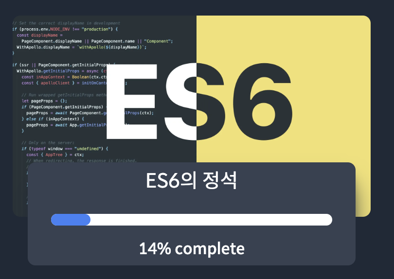

# ES6

저는 강의 + 공식문서를 참고하여 자바스크립트 ES6를 공부하였습니다.

## 1. 강의 소개 : 자바스크립의 ES6, ES7, ES8, ES9 버젼의 함수들에 배우는 이론 강의입니다.

  

유료강의라서 따로 링크는 걸어두지 않았습니다.  
🏠 [노마드코더 홈페이지](https://nomadcoders.co/)

## 2. 왜 자바스크립트를 배워야 할까?
### 1. 웹 개발의 기본 언어
자바스크립트는 웹 개발의 핵심 언어라고 생각합니다. HTML과 CSS와 함께, 자바스크립트는 웹 페이지를 동적이고 상호작용 가능하게 만드는 데 필수적이기 때문입니다.

- **프론트엔드 개발**: 브라우저에서 실행되는 유일한 프로그래밍 언어로, 사용자 인터페이스를 동적이고 상호작용하게 만드는 데 사용됩니다.
- **백엔드 개발**: Node.js를 통해 서버 사이드에서도 자바스크립트를 사용할 수 있어, 프론트엔드와 백엔드 모두에서 동일한 언어를 사용할 수 있습니다.

### 2. 방대한 생태계와 커뮤니티
자바스크립트는 매우 널리 사용되기 때문에, 방대한 라이브러리와 프레임워크가 존재하며, 이를 통해 개발 속도를 높이고 효율성을 극대화할 수 있습니다.

- **프레임워크**: React, Angular, Vue.js 등
- **라이브러리**: jQuery 등
  
🤷🏼 [출처](https://seunghyun90.tistory.com/82)

## 3. 참고 문서 (공부하면서 그때그때 출처를 업로드 할 예정입니다)
📃 [공식문서](https://developer.mozilla.org/ko/docs/Web/JavaScript)
